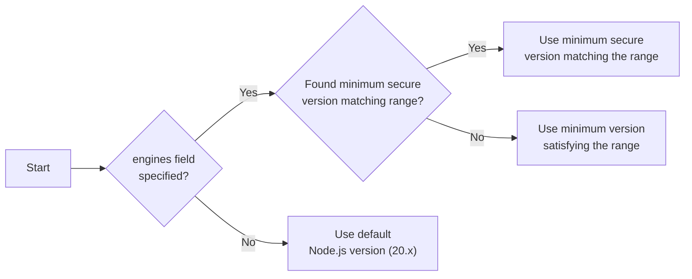

import { Note } from "docs-ui"

export const metadata = {
  title: `Prerequisites for New Projects`,
}

# {metadata.title}

In this guide, learn about the prerequisites for your Arcangel application and storefront before deploying it to Cloud in a new project.

Alternatively, you can create a project from a starter, as explained in the [Create Projects](../page.mdx) guide.

## Who is this guide for?

This guide is intended for developers and teams deploying their local Arcangel applications to Cloud.

You'll learn what setup steps are necessary for:

1. Deploying a Arcangel application (server and admin dashboard) only;
2. Or deploying a Arcangel application along with a storefront.

---

## Prerequisites for Arcangel Application

This section covers the prerequisites for deploying your Arcangel application (server and admin dashboard) to Cloud.

If you're also deploying a storefront with your backend, check the [next section](#prerequisites-for-arcangel-application-with-storefront) for additional prerequisites.

### Supported Node.js Versions

Arcangel supports the Node.js LTS of the following major versions:

- 20.x (default)
- 22.x
- 24.x
- 25.x

<Note>

Starting from [Arcangel v2.19.0](https://github.com/arcangel/arcangel/releases/tag/v2.19.0), the Arcangel application requires Node.js v20.19.0+ or v22.12.0+. So, if you specify a Node.js version as explained next, make sure it satisfies this requirement.

</Note>

#### Specifying Node.js Version

You can override the default Node.js version for your Arcangel application by adding an `engines` field in your `package.json` file:

```json title="package.json"
{
  "engines": {
    "node": ">=22.12.0"
  }
}
```

Arcangel will satisfy this version by the following priority:



1. Find the minimum secure version that matches the range specified in the `engines` field. For example, if your `package.json` specifies `>=21.0.0`, Arcangel will use Node.js v22.x since v21.x is no longer supported.
2. If Arcangel can't find the minimum secure version that matches the range, it will use the minimum version that satisfies the range, even if it's not an LTS version.
3. If no `engines` field is specified, Arcangel will use the default Node.js version (20.x).

### Configurations Managed in Cloud

Your existing Arcangel application (server and admin dashboard) doesn't need specific configurations to be deployed to Cloud. Arcangel automatically:

- Creates the necessary [server and worker instances](!docs!/learn/production/worker-mode).
- Scales your Arcangel application's resources based on the traffic it receives.
- Sets up and configures production resources and modules for your Arcangel application:
    - [Redis Caching Module Provider](!resources!/infrastructure-modules/caching/providers/redis)
    - [Redis Event Module](!resources!/infrastructure-modules/event/redis)
    - [Redis Locking Module Provider](!resources!/infrastructure-modules/locking/redis)
    - [Redis Workflow Engine Module](!resources!/infrastructure-modules/workflow-engine/redis)
    - [S3 File Provider Module](!resources!/infrastructure-modules/file/s3)

Make sure to remove any of these modules from your `arcangel-config.ts` file unless you want to use custom options for them. In that case, you must manually set up and manage those resources externally and configure them in your Arcangel application.

<Note>

The Caching Module was introduced in [Arcangel v2.11.0](https://github.com/arcangel/arcangel/releases/tag/v2.11.0) to replace the deprecated Cache Module. If you're still using the Cache Module, make sure to remove it from your `arcangel-config.ts` file as well.

</Note>

<Note type="warning">

Do not set `projectConfig.databaseUrl`, `projectConfig.databaseDriverOptions`, or `projectConfig.redisUrl` in your `arcangel-config.ts` when deploying to Cloud. Cloud automatically manages the database connection, SSL configuration, connection pooling, and Redis provisioning. Setting these options manually may cause deployment or database migration failures.

</Note>

---

## Prerequisites for Arcangel Application with Storefront

This section covers the prerequisites for deploying your Arcangel application (server and admin dashboard) along with a storefront to Cloud.

Make sure to follow these steps in addition to the ones mentioned in the [previous section](#prerequisites-for-arcangel-application).

<Note type="soon">

Storefront deployment is an experimental feature, and our team is actively working on enhancing it. If you run into any issues, contact support for assistance.

</Note>

### Monorepo Setup

To deploy your Arcangel application along with a storefront, both projects must be set up in a monorepo structure. If you've created your Arcangel application after v2.14.0, it's already set up in a monorepo structure.

To create a monorepo for projects prior to v2.14.0, you need:

1. Package manager: Cloud supports `npm`, `yarn` (v1, v3, and v4), and `pnpm` as package managers.
2. Monorepo tool: You can use [turbo](https://turborepo.com/) or [nx](https://nx.dev/) to manage your monorepo.

You can structure your monorepo as you see fit. You'll be required to specify the paths to your Arcangel application and storefront during the project creation process on Cloud.


### Storefront Supported Node.js Versions

Arcangel uses Node.js v24.x (LTS) to build storefronts. You can't override this version.

So, ensure that your storefront is compatible with Node.js v24.x.

<Note type="warning">

If your storefront's `package.json` has an `engines.node` field that restricts the Node.js version to a range that excludes v24.x (for example, `"22.x"`), the build will fail with a version incompatibility error. Update the field to accept v24.x, for example:

```json title="apps/storefront/package.json"
{
  "engines": {
    "node": ">=22.12.0"
  }
}
```

</Note>

### Build Scripts

In a monorepo, Arcangel doesn't run the `build` script of your root `package.json` file. Instead, it builds your Arcangel application and your storefront separately, each targeting only its own package.

So, instead of a root `build` script, you need:

1. A `build` script in your Arcangel application's `package.json` file that runs the `arcangel build` command.
2. A `build` script in your storefront's `package.json` file that runs the build command, such as `next build`.

```json title="apps/backend/package.json"
{
  "scripts": {
    "build": "arcangel build"
    // other scripts...
  }
}
```

Arcangel only builds the target package and the workspace packages it depends on. The other packages of your monorepo don't enter the build process. Learn more about the build process in the [Deployments](../../deployments/page.mdx#build-process-for-deployments) guide.

#### Root Files Available During the Build (Turborepo)

If you're using `turbo`, Arcangel prunes your monorepo down to the package it's building before installing dependencies. As a result, the build only has access to the following files from the root of your monorepo:

- `package.json`
- The lockfile
- `pnpm-workspace.yaml`
- `turbo.json`
- `.gitignore`
- `.npmrc`

Arcangel doesn't copy any other root file into the build, along with the packages that the target package doesn't depend on. For example, if a workspace package's `tsconfig.json` file extends a shared `tsconfig.base.json` file at the root, the build fails with the following error, even though the build succeeds locally:

```bash
error TS5083: Cannot read file '/tsconfig.base.json'.
```

To fix this, move the shared file into a workspace package, then add that package as a dependency of your Arcangel application or storefront. Arcangel then includes the file in the build, since it builds the target package along with the workspace packages it depends on.

This also applies to files that your Arcangel application needs at runtime, such as JSON files or fonts. Keep them within your Arcangel application, then copy them to the `.arcangel/server` directory as part of your `build` script. Learn more in the [Built Assets](!docs!/learn/build#built-assets) documentation.

If you're using `nx` instead of `turbo`, Arcangel doesn't prune your monorepo, so all root files are available during the build.

### Prerequisites for Yarn Workspaces

If you're using `yarn` as your package manager, create the `.yarnrc.yml` file in the root of your monorepo with the following content:

```yaml title=".yarnrc.yml"
nodeLinker: node-modules

nmHoistingLimits: workspaces
```

You set the following configurations:

1. `nodeLinker: node-modules`: Configures Yarn to install dependencies using the traditional `node_modules` structure, which is required for Arcangel applications.
2. `nmHoistingLimits: workspaces`: Ensures that dependencies are hoisted only to the workspace level, preventing potential conflicts between packages in the monorepo.

{/* ### Prerequisites for PNPM Workspaces

If you're using `pnpm` as your package manager, set up the following configurations in your monorepo.

First, create the `.npmrc` file in the root of your monorepo with the following content:

```text title=".npmrc"
auto-install-peers=true
strict-peer-dependencies=false
shared-workspace-lockfile=false
```

You set the following configurations:

1. `auto-install-peers=true`: Ensures that peer dependencies are automatically installed when you install packages, preventing potential issues with missing peer dependencies.
2. `strict-peer-dependencies=false`: Allows more flexibility when resolving peer dependencies, which can be helpful in a monorepo setup.
3. `shared-workspace-lockfile=false`: Ensures that each package in the monorepo can have its own lockfile, which is necessary for Arcangel to resolve dependencies correctly.

Next, create the `pnpm-workspace.yaml` file in the root of your monorepo with the following content:

```yaml title="pnpm-workspace.yaml"
packages:
  - "apps/**"
  - "!apps/backend/.arcangel/**"
```

This configuration specifies the packages that are part of your pnpm workspace. The example above includes all packages under the `apps` directory, except for the `.arcangel` directory within the `backend` package.

Finally, add the `.npmrc` file to your Arcangel application's root directory if it doesn't already exist, with the following content:

```text title="apps/backend/.npmrc"
public-hoist-pattern[]=*@arcangel/*
public-hoist-pattern[]=@tanstack/react-query
public-hoist-pattern[]=react-i18next
public-hoist-pattern[]=react-router-dom
```

This configuration ensures that specific dependencies are hoisted to the root `node_modules` directory, which is necessary for Arcangel to function correctly. */}

### Prerequisites for NPM Workspaces

If you're using `npm` as your package manager with Turbo, you must add the `packageManager` field to your root `package.json`:

```json title="package.json"
{
  "packageManager": "npm@10.9.2"
}
```

Replace `10.9.2` with your installed npm version (run `npm --version` to check). Turborepo requires this field when pruning with NPM workspaces. Without it, the build will fail with a `Missing 'packageManager' field` error.

If you're also using the [Next.js Starter Storefront](!resources!/nextjs-starter) as your storefront, add the following override in the storefront's `package.json`:

```json title="apps/storefront/package.json"
{
  "overrides": {
    // other overrides...
    "@arcangel/icons": {
      "react": "19.0.4",
      "react-dom": "19.0.4"
    }
  }
}
```

This ensures the `@arcangel/icons` package uses compatible versions of `react` and `react-dom` with the Next.js Starter Storefront.

Also, add the following override in your monorepo's root `package.json`:

```json title="package.json"
{
  "overrides": {
    // other overrides...
    "react": "19.0.4",
    "react-dom": "19.0.4"
  }
}
```

This ensures that all packages in your monorepo use compatible versions of `react` and `react-dom`.

### Supported Storefront Frameworks

Cloud currently supports deploying storefronts built with the following frameworks:

1. [Next.js](https://nextjs.org/) v15. v16 is also supported if you're not using a [proxy](https://nextjs.org/docs/app/getting-started/proxy).
2. [SvelteKit](https://kit.svelte.dev/) v2.40.0+
3. [Tanstack Start](https://tanstack.com/start) v1.132.0+ (React and Solid)

If you're using a different framework for your storefront, contact support to request it.

---

## Additional Storefront Considerations

When deploying your storefront to Cloud, there are additional considerations to keep in mind related to the build process, environment variables, and custom domains.

Refer to the [Storefront](../../storefront/page.mdx) guide for more details on these considerations.

---

## Next Steps

Now that you know the prerequisites for deploying your Arcangel application and storefront to Cloud, you can create your project.

Refer to the [Project](../page.mdx) guide to learn how to create a new project on Cloud.
